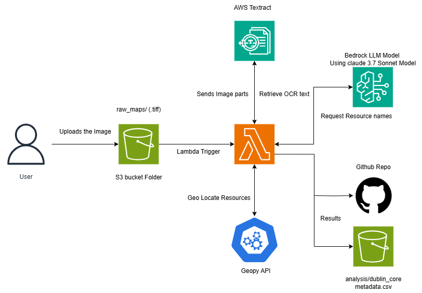

# GeoReference-CSU

An automated AWS pipeline for processing historical water resource maps, extracting water feature information using OCR and AI, and generating georeferenced data.

## Project Overview

This project creates a serverless pipeline that:
1. Processes uploaded TIF map images
2. Extracts text using AWS Textract
3. Identifies water resources using AWS Bedrock
4. Generates geolocation data and GeoJSON files
5. Creates standardized Dublin Core metadata

## Architecture



Key Components:
- AWS S3 for storage
- AWS Lambda for processing
- AWS Textract for OCR
- AWS Bedrock (Claude 3.5 Sonnet) for text analysis
- Nominatim/Geopy for geocoding
- AWS CodeBuild for deployment

## Quick Start

### Prerequisites

- AWS CLI configured with appropriate permissions
- GitHub account with repository access
- Python 3.13+
- Node.js 20+
- Bash shell environment

### Deployment

1. Clone the repository:
```bash
git clone https://github.com/your-username/GeoReference-CSU.git
cd GeoReference-CSU/Backend
```

2. Run the deployment script:
```bash
chmod +x scripts/deploy.sh
./scripts/deploy.sh
```

3. When prompted, provide:
- Source GitHub repository URL
- Client's private GitHub repository URL
- Client's GitHub token
- S3 bucket name (must be globally unique)
- Other configuration parameters

### Usage

1. Upload TIF files to the S3 bucket:
```bash
aws s3 cp your-map.tif s3://your-bucket-name/raw_maps/
```

2. The system will automatically:
- Split large images for processing
- Perform OCR using AWS Textract
- Extract water resource names using AWS Bedrock
- Generate geolocation data
- Create GeoJSON files
- Update Dublin Core metadata

3. Output files will be:
- GeoJSON files in the client's GitHub repository
- Metadata CSV in the S3 analysis folder
- Error logs (if any) in the S3 error folder

## Folder Structure

```
├── Architecture/          # Architecture diagrams
├── Backend/              # Main project code
│   ├── bin/             # CDK app entry point
│   ├── lambda/          # Lambda function code
│   ├── layers/          # Lambda layers
│   ├── lib/             # CDK stack definition
│   └── scripts/         # Deployment scripts
```

## Configuration

Key environment variables (set during deployment):
- `BUCKET_NAME`: S3 bucket for storage
- `ERROR_FOLDER`: Folder for error logs
- `ANALYSIS_FOLDER`: Folder for processed data
- `GITHUB_TOKEN`: Client's GitHub access token
- `GITHUB_REPO`: Client's repository name
- `BEDROCK_MODEL_ID`: AWS Bedrock model identifier
- `BEDROCK_REGION`: AWS region for Bedrock

## Input Requirements

- File format: TIF
- Content: Historical maps containing water resources
- Location: Upload to `raw_maps/` folder in S3 bucket

## Output Format

1. GeoJSON files containing:
   - Water resource points
   - Map boundary polygon
   - Resource properties and metadata

2. Dublin Core metadata CSV with:
   - Resource titles
   - Spatial coverage
   - Coordinates
   - Description
   - Other standard metadata fields

## Error Handling

- Failed processes logged to error folder
- Automatic retries for geocoding
- Size limit handling for large images
